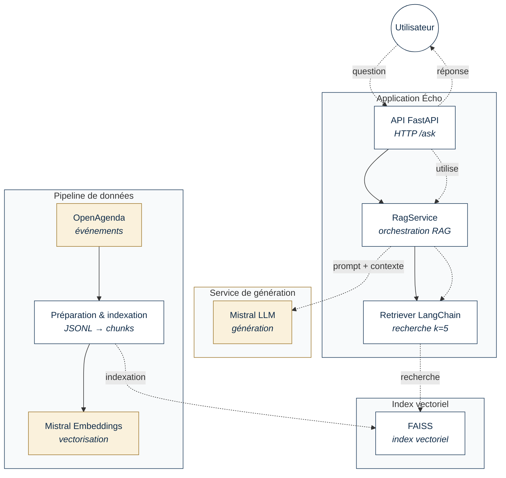

# Diagramme UML de composants — Écho

Diagramme UML de composants simplifié du système RAG Écho (Puls-Events). Quatre zones :

- **Application Écho** : API FastAPI, RagService, Retriever LangChain.
- **Index vectoriel** : FAISS (index `index.faiss` + `index.pkl`).
- **Pipeline de données** : OpenAgenda → Préparation & indexation → Mistral Embeddings.
- **Service de génération** : Mistral LLM.

Le SVG inline du rapport HTML est dans [`assets/architecture_uml_components.svg`](assets/architecture_uml_components.svg). Le bloc Mermaid ci-dessous est la source de vérité.



## Notes

- **Docker Compose** et **Swagger /docs** ne figurent pas dans le diagramme principal : ils relèvent du déploiement local et de la documentation, et sont décrits séparément dans la section "Docker" du rapport et du README.
- Les flèches pointillées suivent la notation UML standard de **dépendance** (`«use»`).
- Les composants externes (OpenAgenda, Mistral LLM, Mistral Embeddings) sont représentés en beige pour les distinguer des composants applicatifs internes Écho.

## Export SVG

Le SVG inline du rapport HTML ([`assets/architecture_uml_components.svg`](assets/architecture_uml_components.svg)) a été produit à la main pour rester indépendant de toute toolchain Node. Pour le régénérer depuis le source Mermaid ci-dessus :

```bash
# Installation locale (hors projet, ne pas ajouter à pyproject)
npx -p @mermaid-js/mermaid-cli mmdc \
  -i docs/architecture_diagram.md \
  -o docs/assets/architecture_uml_components.svg \
  -b transparent

# PNG haute résolution pour les slides
npx -p @mermaid-js/mermaid-cli mmdc \
  -i docs/architecture_diagram.md \
  -o docs/assets/architecture_uml_components.png \
  -w 1600 -H 1400 -b white
```
