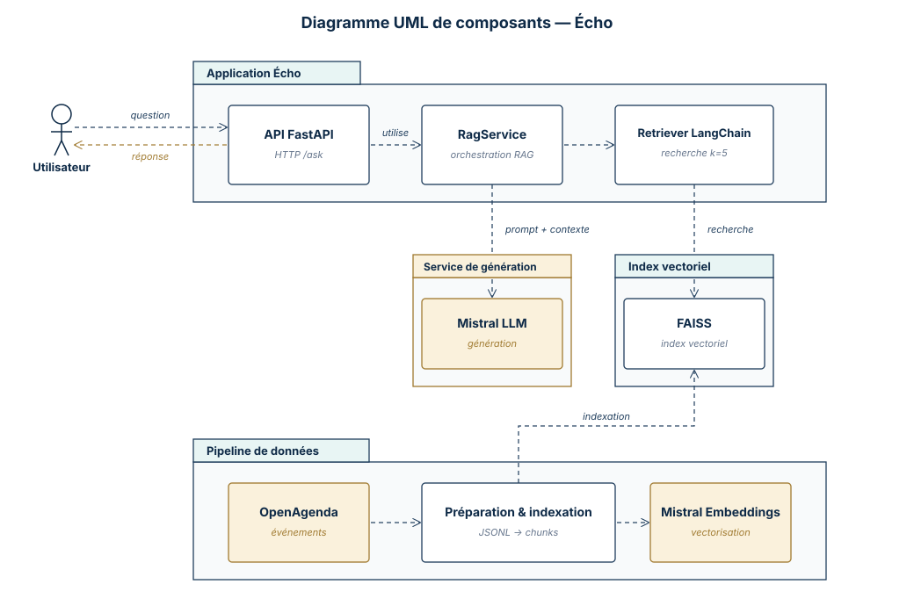

# Rapport technique — Écho, assistant RAG de recommandation d’événements culturels

    

## Sommaire

1. [Objectifs du projet](#1-objectifs-du-projet)
2. [Architecture du système](#2-architecture-du-système)
3. [Préparation et vectorisation des données](#3-préparation-et-vectorisation-des-données)
4. [Choix du modèle NLP](#4-choix-du-modèle-nlp)
5. [Base vectorielle et recherche sémantique](#5-base-vectorielle-et-recherche-sémantique)
6. [API et endpoints exposés](#6-api-et-endpoints-exposés)
7. [Évaluation du système](#7-évaluation-du-système)
8. [Recommandations et perspectives](#8-recommandations-et-perspectives)
9. [Organisation du dépôt GitHub](#9-organisation-du-dépôt-github)
10. [Annexes](#10-annexes)

## 1. Objectifs du projet

### Contexte

Puls-Events souhaite proposer un assistant intelligent capable d’aider les utilisateurs à trouver des événements culturels pertinents autour du Bassin d’Arcachon, à partir de données issues d’[OpenAgenda](https://public.opendatasoft.com/explore/assets/evenements-publics-openagenda/view/) exposées via Opendatasoft.

Le projet consiste à concevoir un système RAG, c’est-à-dire un système qui combine :

- une base documentaire construite à partir d’événements OpenAgenda ;
- une recherche vectorielle pour retrouver les événements proches d’une question utilisateur ;
- un modèle de langage pour générer une réponse naturelle à partir des événements retrouvés.

L’application développée dans le cadre du POC s’appelle **Écho**.

### Problématique

Les événements culturels sont souvent décrits dans des formats hétérogènes : descriptions longues ou courtes, champs parfois incomplets, dates multiples, lieux différents, liens externes, images et métadonnées diverses.

Un système RAG répond à ce besoin car il permet de :

- rechercher dans une base documentaire locale ;
- retrouver les passages les plus pertinents pour une question ;
- générer une réponse contextualisée ;
- limiter les réponses inventées en s’appuyant sur les documents retrouvés.

L’objectif n’est donc pas seulement de poser une question à un modèle de langage, mais de lui fournir un contexte fiable issu des événements collectés.

### Objectif du POC

Le POC doit démontrer la faisabilité technique d’un assistant culturel basé sur un système RAG.

Les objectifs principaux sont :

- collecter des événements depuis OpenAgenda ;
- nettoyer et normaliser les données ;
- transformer les événements en documents textuels exploitables ;
- découper ces documents en chunks ;
- générer des embeddings ;
- construire un index vectoriel FAISS ;
- tester la recherche sémantique ;
- intégrer un modèle de langage pour générer les réponses ;
- exposer le système via une API.

### Périmètre

Le périmètre du POC est volontairement limité afin de rester simple et maîtrisable.

Le corpus utilisé est composé d’événements OpenAgenda autour du Bassin d’Arcachon. Les données sont préparées localement. Le fichier de documents RAG est versionné pour faciliter la reconstruction locale de l’index, tandis que l’index FAISS reste généré localement.

Le POC implémente et teste l’ensemble de la chaîne RAG : préparation des données, chunking, embeddings Mistral, index FAISS LangChain, recherche sémantique, génération Mistral, API FastAPI et évaluation automatique sur un jeu annoté.

## 2. Architecture du système

### Diagramme UML de composants

Le diagramme regroupe les éléments du système Écho en quatre zones : l'application Écho (API, service RAG, retriever), le service externe de génération (Mistral LLM), l'index vectoriel (FAISS) et le pipeline de données (OpenAgenda → préparation → embeddings).



Le diagramme se lit en deux flux :

- **Flux question / réponse (en haut)** : l'utilisateur envoie une question HTTP à l'API FastAPI, qui délègue à `RagService`. Celui-ci appelle le `Retriever LangChain` (recherche FAISS, k=5) pour récupérer les chunks pertinents, puis transmet la question + contexte au `Mistral LLM` qui génère la réponse.
- **Flux d'indexation (en bas)** : les événements OpenAgenda sont collectés puis préparés (filtrage, nettoyage, conversion en JSONL, chunking). Le composant `Préparation & indexation` utilise `Mistral Embeddings` pour vectoriser les chunks et alimente l'index FAISS.


### Données entrantes

Les données entrantes proviennent d’OpenAgenda via l’API Opendatasoft. Le pipeline de collecte et de préparation est découpé en scripts courts, chacun responsable d’une étape précise.

| Étape | Script | Rôle | Sortie principale |
|---|---|---|---|
| Collecte | `01_fetch_openagenda_events.py` | Récupérer les événements bruts depuis OpenAgenda. | `data/raw/openagenda_events_raw.json` |
| Filtrage | `02_filter_openagenda_events.py` | Conserver le périmètre géographique et temporel du POC. | `data/processed/events_filtered.json` |
| Nettoyage | `03_clean_openagenda_events.py` | Normaliser les textes, les dates et les métadonnées utiles. | `data/processed/events_clean.json` |
| Documents RAG | `04_build_event_documents.py` | Transformer les événements nettoyés en documents indexables. | `data/processed/events_documents.jsonl` |

Le fichier `events_documents.jsonl` est ensuite utilisé pour construire le vector store FAISS.

Les scripts sont situés dans le dossier `scripts/`.

### Prétraitement, embeddings et base vectorielle

Les événements nettoyés sont transformés en documents Markdown. Ce format reste lisible par un humain tout en donnant au modèle un texte structuré à indexer.

Exemple court de document indexable :

```markdown
# Initiation à l'astronomie à Lanton

## Description

Initiation à l'astronomie et observation aux instruments.

## Informations pratiques

- Ville : Lanton
- Dates : du 2026-01-05 19:30 au 2027-01-03 21:30
```

Ces documents sont ensuite découpés en chunks, puis vectorisés avec le modèle d’embedding Mistral.

Les vecteurs et leurs métadonnées sont stockés dans un vector store FAISS LangChain (`langchain_community.vectorstores.FAISS`), qui les sauvegarde localement sous forme de deux fichiers `index.faiss` + `index.pkl`.

### Intégration LLM

L’intégration avec le modèle de langage est portée par la classe `RagService`, dans `echo_app/rag/rag_service.py`. Cette classe orchestre :

1. la recherche sémantique via le retriever LangChain obtenu avec `vectorstore.as_retriever(search_kwargs={"k": top_k})`, appelé par `retriever.invoke(question)` ;
2. la construction d’un contexte numéroté à partir des `Document` retrouvés : chaque chunk est préfixé par `[1]`, `[2]`, etc. pour distinguer les sources utilisées ;
3. la construction d’un message utilisateur combinant ce contexte et la question ;
4. l’appel à Mistral via `client.chat.complete()` ;
5. l’extraction d’une liste de sources lisibles, dédoublonnée par `event_id`.

Exemple simplifié de contexte envoyé au modèle :

```text
[1] Initiation à l'astronomie — Lanton
Découverte du ciel et observation des étoiles.

---
[2] Nuit des étoiles — Le Teich
Animation autour de l'observation astronomique.
```

Le message utilisateur final combine ensuite ce contexte avec la question :

```text
Contexte (extraits d'événements) :
[1] Initiation à l'astronomie — Lanton
...

Question de l'utilisateur :
Quels événements autour de l'astronomie sont proposés ?
```

Le modèle de génération utilisé est `mistral-small-latest`, configurable via la variable d’environnement `MISTRAL_MODEL`. Le client Mistral est créé uniquement au moment de générer une réponse, ce qui permet d’instancier `RagService` sans clé API en environnement de test.

### Exposition via API

L’API FastAPI est implémentée dans [`echo_app/api/`](../echo_app/api/). Elle expose les endpoints nécessaires au POC : vérification de santé, métadonnées techniques, question à Écho et reconstruction locale de l’index.

La logique RAG reste isolée dans `echo_app/rag/rag_service.py` : l’API ne fait que valider les requêtes, appeler le service métier et formater les réponses. Les endpoints, les formats de requête/réponse et les choix de gestion d’erreur sont détaillés dans la section [6. API et endpoints exposés](#6-api-et-endpoints-exposés).

### Technologies utilisées

Les principales technologies utilisées sont :

- Python 3.12 ;
- Poetry pour la gestion de l’environnement ;
- OpenAgenda / Opendatasoft pour les données ;
- pandas pour l’exploration et la préparation des données ;
- Mistral AI pour les embeddings et la génération de réponse ;
- FAISS via LangChain pour l’index vectoriel et la recherche sémantique ;
- FastAPI pour l’API locale ;
- Docker et Docker Compose pour lancer l’API dans un environnement reproductible ;
- pytest pour les tests automatisés ;
- ruff pour la qualité du code.

## 3. Préparation et vectorisation des données

### Source de données

Les événements sont collectés depuis OpenAgenda. La collecte récupère des événements culturels, puis le pipeline applique un filtrage afin de conserver un périmètre cohérent avec le POC.

> [!NOTE]
> Une date de référence fixe (`2026-05-01`) est utilisée pour rendre le POC reproductible et obtenir des résultats stables pendant le développement.

Exemple simplifié de donnée OpenAgenda avant préparation :

```json
{
  "title_fr": "Initiation à l'astronomie à Lanton",
  "location_city": "Lanton",
  "firstdate_begin": "2026-01-05T19:30:00+00:00",
  "description_fr": "Initiation à l'astronomie et observation aux instruments.",
  "longdescription_fr": "<p>✨ Découvrez le ciel nocturne comme vous ne l’avez jamais observé 🌙🔭</p>\n<p>Lors de cette <strong>soirée d’observation du ciel</strong>, laissez-vous émerveiller par les beautés cachées de l’espace, visibles uniquement grâce aux <strong>télescopes et aux jumelles astronomiques</strong>.<br>Planètes, galaxies, nébuleuses… vous découvrirez les plus beaux objets célestes du moment.</p>\n<p>Tout au long de la soirée, vous comprendrez :</p>\n<ul>\n<li>le <strong>parcours de vie d’une étoile</strong>, de sa naissance à sa fin</li>\n<li>les grands principes de la <strong>mécanique céleste</strong> et le déplacement apparent des astres</li>\n</ul>\n<p>Vous apprendrez également à :</p>\n<ul>\n<li>reconnaître plusieurs <strong>constellations</strong>, et peut-être celle de votre <strong>signe zodiacal</strong> si elle est visible</li>\n<li>découvrir les <strong>mythes et légendes</strong> associés aux constellations</li>\n</ul>\n<p>Des <strong>expériences simples et ludiques</strong> viendront accompagner les explications pour mieux comprendre le fonctionnement de notre ciel.</p>\n<p>Ce sera aussi l’occasion de :</p>\n<ul>\n<li>découvrir <strong>comment fonctionne un télescope</strong></li>\n<li>poser toutes vos questions si vous envisagez d’en acquérir un, afin de faire un choix éclairé</li>\n</ul>\n<p>Dans une ambiance conviviale et un cadre naturel inhabituel, cette soirée est une invitation à <strong>lever les yeux vers les étoiles</strong>, à se détendre et à partager un moment hors du temps.</p>\n<p>Durée : 2h30</p>\n<p>Activité organisée par Arnaud - Animateur scientifique</p>\n<p>Infos et réservation sur <a href=\"https://www.eco-nature.org/experience/initiation-a-l-astronomie-a-lanton-3725\">EcoNature : </a><a href=\"https://www.eco-nature.org/experience/initiation-a-l-astronomie-a-lanton-3725\">https://www.eco-nature.org/experience/initiation-a-l-astronomie-a-lanton-3725</a></p>",
  "conditions_fr": "Tarifs : Enfant -18 ans 10€ ; Adulte 18 ans et + 20€",
  "keywords_fr": [
    "Nature",
    "Sortie nature",
    "astronomie"
  ],
  "image": "https://cdn.openagenda.com/main/7d4acecf130c4c8cae6f20fcc5c64d56.base.image.jpg",
}
```

### Nettoyage des données

Les événements bruts contiennent des champs hétérogènes. Le nettoyage permet de produire des données plus régulières et plus faciles à indexer.

Les traitements réalisés incluent notamment :

- suppression ou conversion du HTML inutile ;
- conversion du contenu utile en Markdown simple ;
- normalisation des champs textuels ;
- conservation des dates ;
- conservation des informations de lieu ;
- extraction ou conservation des coordonnées lorsque disponibles ;
- suppression des liens bruts répétés dans le texte indexable.

Les URL ne sont pas intégrées dans le texte indexable. Elles sont conservées dans les métadonnées afin de pouvoir être affichées après la recherche.

Par exemple, un fragment HTML comme `<p>✨ Découvrez le ciel...</p>` est converti en texte simple : `✨ Découvrez le ciel...`.

### Construction des documents RAG

Chaque événement est transformé en document RAG.

Chaque document contient :

- `document_text` : texte Markdown utilisé pour l’indexation ;
- `metadata` : informations structurées conservées séparément.

Exemple de métadonnées conservées avec le document :

```json
{
  "event_id": "13708573",
  "title": "Initiation à l'astronomie à Lanton",
  "city": "Lanton",
  "start_date": "2026-01-05T19:30:00+00:00",
  "url": "https://openagenda.com/...",
  "latitude": 44.783281,
  "longitude": -0.934394
}
```

Cette séparation permet de garder un texte propre pour les embeddings, tout en conservant les informations utiles pour l’affichage des résultats.

Exemple court de document Markdown produit pour l’indexation :

```markdown
# Initiation à l'astronomie à Lanton

## Description

Initiation à l'astronomie et observation aux instruments.

## Informations pratiques

- Ville : Lanton
- Dates : du 2026-01-05 19:30 au 2027-01-03 21:30
```

### Chunking

Avant la vectorisation, les documents sont découpés en chunks.

L’objectif du chunking est d’éviter d’envoyer des textes trop longs au modèle d’embedding et d’améliorer la précision de la recherche. Un chunk représente un morceau de document qui peut être retrouvé indépendamment dans l’index FAISS.

La stratégie retenue est volontairement simple :

- les événements courts restent en un seul chunk ;
- les événements longs sont découpés par taille ;
- un léger overlap est ajouté entre deux chunks pour limiter la perte de contexte ;
- les chunks trop petits sont évités ;
- le titre de l’événement est rappelé dans les chunks découpés lorsque c’est possible.

Les paramètres principaux sont :

```text
CHUNK_SIZE = 1200
CHUNK_OVERLAP = 150
MIN_CHUNK_SIZE = 200
```
> [!NOTE]
> Cette stratégie a été retenue car le corpus OpenAgenda utilisé **contient majoritairement des documents courts**. Un découpage par structure Markdown n’a pas été conservé car il risquait de séparer des informations importantes d’un même événement. Un découpage par phrases avec spaCy aurait aussi ajouté de la complexité sans apporter de gain évident pour ce POC.

### Génération des embeddings

Chaque chunk est transformé en vecteur numérique avec le modèle d’embedding Mistral.

Le modèle utilisé est `mistral-embed`, qui produit des vecteurs de dimension `1024`.

La génération des embeddings est faite par batchs. Un batch est différent d’un chunk : le chunk correspond à une unité de contenu indexée, tandis que le batch est seulement un regroupement technique de plusieurs chunks envoyés ensemble à l’API Mistral.

Cette logique permet d’éviter de faire un appel API séparé pour chaque chunk.

Le pipeline vérifie également que les embeddings retournés ont bien la dimension attendue avant de les envoyer à FAISS. Cela évite de construire un index incohérent.

## 4. Choix du modèle NLP

### Modèle d’embedding

Pour la vectorisation, le modèle retenu est : `mistral-embed`.


Utiliser Mistral pour les embeddings et la génération permet de garder une configuration homogène : une seule clé API, une seule bibliothèque Python et des modèles compatibles avec le reste de la chaîne RAG.

Les raisons principales sont :

- intégration simple via l’API Mistral ;
- modèle adapté à des textes en langage naturel ;
- dimension fixe de 1024 ;
- compatibilité avec une indexation FAISS locale.

### Modèle de génération

Le modèle de génération est utilisé pour produire la réponse finale à partir des chunks retrouvés par la recherche sémantique.

Le modèle par défaut est : `mistral-small-latest`.

Il est configurable via la variable d’environnement `MISTRAL_MODEL`. L’appel est effectué via `client.chat.complete()` de la bibliothèque Python Mistral, dans la méthode `_generate_answer()` de `RagService`. Cette méthode est isolée pour faciliter les tests avec un faux client Mistral.

> [!IMPORTANT]
> **Résilience face aux erreurs Mistral**
>
> Mistral peut renvoyer ponctuellement un HTTP `429` avec le message `service_tier_capacity_exceeded` lorsque le modèle est temporairement saturé côté serveur. Pour absorber ces pics, `_generate_answer()` retente l’appel une seule fois après 2 secondes lorsque l’erreur correspond à ce cas, et laisse remonter toute autre exception sans retry.

### Prompting

Les prompts sont versionnés dans `echo_app/rag/prompts.py` :

- `RAG_SYSTEM_PROMPT` contient les règles générales de Écho (voir [Prompt système utilisé](#prompt-système-utilisé) en annexe) ;
- `build_user_prompt()` construit le message utilisateur à partir du contexte retrouvé et de la question.

Cette séparation permet de faire évoluer le cadrage métier sans modifier directement le service RAG.

Le prompt envoyé à Mistral est composé de deux messages :

| Message | Rôle |
|---|---|
| `system` | Définit la persona Écho et les règles de réponse. |
| `user` | Contient les chunks retrouvés par FAISS, puis la question posée. |

Les règles principales du message système sont volontairement simples : répondre en français, utiliser uniquement le contexte fourni, ne pas inventer d’événement, et signaler clairement quand le contexte ne permet pas de répondre.

Le message utilisateur contient un contexte numéroté (`[1]`, `[2]`, etc.) afin de faciliter la traçabilité entre les chunks retrouvés, la réponse générée et les sources affichées.

Dans cette partie, LangChain sert surtout à assembler les messages envoyés au modèle grâce à `ChatPromptTemplate`. Son rôle dans la recherche vectorielle est détaillé dans la section [5. Base vectorielle et recherche sémantique](#5-base-vectorielle-et-recherche-sémantique).

Les messages obtenus sont ensuite convertis en dictionnaires simples, compatibles avec `client.chat.complete()` de la bibliothèque Python Mistral.

Le paramètre `temperature=0.2` est utilisé pour limiter la créativité du modèle et privilégier des réponses ancrées dans le contexte.

> [!NOTE]
> Aucun historique conversationnel n’est utilisé : chaque question est traitée indépendamment. Ce choix garde le POC simple et limite les effets de bord.

Si la recherche FAISS ne retourne aucun résultat, le service n’appelle pas le modèle. Il renvoie directement une réponse explicite avec une liste de sources vide. Cela évite un appel API inutile et garantit un comportement déterministe.

### Limites du modèle

La qualité des réponses dépendra de plusieurs facteurs :

- qualité des descriptions OpenAgenda ;
- pertinence des chunks retrouvés ;
- capacité du modèle à respecter le contexte fourni ;
- présence ou absence d’informations suffisantes dans les événements collectés.

L’utilisation d’un système RAG réduit le risque de réponse inventée, mais ne le supprime pas complètement. L’évaluation automatique repose sur un jeu annoté de 15 questions, qui peut être enrichi pour obtenir une mesure plus robuste.

## 5. Base vectorielle et recherche sémantique

### Intégration avec LangChain

Le système utilise le vector store FAISS fourni par LangChain (`langchain_community.vectorstores.FAISS`). Les chunks OpenAgenda sont convertis en objets `Document`, indexés avec les embeddings Mistral, puis sauvegardés localement dans `vector_store/`.

LangChain apporte trois abstractions utiles dans le projet :

| Élément | Rôle dans Écho |
|---|---|
| `Document` | Associer un texte de chunk à ses métadonnées. |
| `FAISS` | Stocker les vecteurs et effectuer la recherche de similarité. |
| `Retriever` | Interroger FAISS depuis `RagService` avec `.as_retriever(search_kwargs={"k": 5})`. |

Au moment de répondre à une question, `RagService` charge l’index, récupère les documents pertinents avec le retriever, puis transmet leur contenu à la chaîne de génération.

### Recherche vectorielle

Le vector store LangChain s’appuie sur un index FAISS `IndexFlatL2`. Ce choix est adapté au POC car le volume de données est faible, l’index est simple à construire et la recherche reste exacte.

`IndexFlatL2` compare les vecteurs avec une distance L2 : plus la distance est faible, plus le chunk est proche de la question utilisateur.

Dans le corpus utilisé, le pipeline produit `138` documents OpenAgenda, découpés en `155` chunks. Chaque chunk reçoit un embedding, ce qui donne `155` vecteurs dans FAISS.

> [!NOTE]
> Un filtrage par écart de distance L2 a été ajouté pour éviter d’envoyer au modèle des sources nettement moins proches que le meilleur résultat. Le seuil reste empirique et devra être validé sur un jeu plus large.

### Persistance de l’index

Le vector store est sauvegardé localement dans le dossier `vector_store/` avec le format LangChain :

| Fichier | Contenu |
|---|---|
| `vector_store/index.faiss` | Vecteurs numériques utilisés par FAISS. |
| `vector_store/index.pkl` | Docstore LangChain : texte des chunks et métadonnées associées. |

Ces fichiers sont générés localement et ne sont pas versionnés dans Git. Le script de reconstruction nettoie aussi les fichiers résiduels éventuels afin de garder un dossier `vector_store/` cohérent.

### Métadonnées associées

Les métadonnées des événements sont conservées dans les `Document` LangChain associés aux chunks. Elles ont déjà été préparées lors de la construction des documents RAG, puis sont réutilisées après la recherche pour afficher les sources.

Après une recherche vectorielle, `retriever.invoke(question)` retourne une liste de `Document` : le texte du chunk est disponible dans `page_content`, et les informations utiles à l’affichage des sources restent disponibles dans `metadata`.

### Reconstruction de l’index

L’index peut être reconstruit avec la commande suivante :

```bash
poetry run python scripts/rebuild_index.py
```

Cette commande régénère entièrement le vector store à partir des documents pré-processés :

1. charger `data/processed/events_documents.jsonl` ;
2. construire les chunks ;
3. générer les embeddings Mistral ;
4. convertir les chunks en `Document` LangChain ;
5. construire le vector store FAISS ;
6. sauvegarder `index.faiss` et `index.pkl` dans `vector_store/`.

> [!NOTE]
> L’index est reconstruit entièrement plutôt que mis à jour partiellement. 

## 6. API et endpoints exposés

### Framework utilisé

L’API du projet est implémentée avec FastAPI, dans le dossier [`echo_app/api/`](../echo_app/api/).

FastAPI est utilisé car il permet de construire une API Python typée, documentée automatiquement via Swagger, et facile à tester avec `TestClient`.

### Exécution locale avec Docker

L’API peut être lancée localement avec Docker Compose. Cette approche permet de tester le service dans un environnement reproductible, sans dépendre directement de l’environnement Python local.

```bash
docker compose up --build
```

Au démarrage, l’application affiche l’URL de la documentation Swagger afin de faciliter les tests manuels dans le navigateur : http://127.0.0.1:8000/docs.

> [!NOTE]
> Le vector store FAISS doit être disponible localement dans vector_store/ pour que l’API puisse répondre aux questions. Il reste généré localement et n’est pas versionné dans Git.


### Endpoints exposés

L’API expose quatre endpoints principaux :

| Endpoint | Rôle |
|---|---|
| `GET /health` | Vérifie que l’API répond avec un statut minimal. |
| `GET /metadata` | Expose des informations techniques non sensibles sur le système RAG : disponibilité du vector store, nombre de chunks, modèles utilisés, dernier rebuild. |
| `POST /ask` | Reçoit une question utilisateur et retourne une réponse générée avec ses sources. |
| `POST /rebuild` | Reconstruit localement l’index FAISS avec une confirmation explicite (`confirm=true`). |

La documentation interactive Swagger est générée automatiquement par FastAPI et disponible sur `/docs` lorsque l’API est lancée localement.

> [!WARNING]
> `POST /rebuild` est utile pour le POC local, mais il devrait être protégé ou remplacé par une tâche interne si l’API était exposée en production.

### Séparation API / logique métier

La couche API ne réimplémente pas la logique RAG. L’endpoint `POST /ask` appelle directement `RagService.ask(question)`, qui orchestre le retriever FAISS LangChain, la construction du contexte, le prompt LangChain et l’appel Mistral.

La reconstruction de l’index est portée par `echo_app.indexing.rebuild.rebuild_index()`. Cette fonction est utilisée à la fois par le script CLI `scripts/rebuild_index.py` et par l’endpoint `POST /rebuild`, ce qui évite de dupliquer la logique.

### Format des requêtes et réponses

Exemple de requête pour `/ask` :

```json
{
  "question": "Quels événements autour de l’astronomie sont disponibles ?"
}
```

Exemple de réponse :

```json
{
  "question": "Quels événements autour de l astronomie sont proposés ?",
  "answer": "D'après le contexte fourni, un seul événement autour de l'astronomie est proposé :\n\n**Initiation à l'astronomie à Lanton** (Lanton)\nUne soirée d'observation du ciel nocturne avec initiation aux instruments et découverte des constellations, le **5 janvier 2026 à 19h30** à Blagon (Lanton). Tarifs : 10€ pour les enfants, 20€ pour les adultes. Réservation via EcoNature.",
  "sources": [
    {
      "event_id": "13708573",
      "title": "Initiation à l'astronomie à Lanton",
      "city": "Lanton",
      "start_date": "2026-01-05T19:30:00+00:00",
      "url": "https://openagenda.com/econature/events/initiation-a-lastronomie-a-lanton"
    }
  ]
}
```

`GET /metadata` n’expose pas de clé API ni de chemin local absolu. Les noms de modèles (`mistral-embed`, `mistral-small-latest`) sont des informations techniques non sensibles.

### Tests et gestion des erreurs

Les tests API sont regroupés dans `tests/test_api.py`. Ils utilisent `TestClient` et des fakes pour éviter tout appel réel à Mistral ou tout chargement réel de FAISS pendant les tests unitaires.

Les principaux comportements testés sont :

- `/health` retourne un statut minimal ;
- `/metadata` expose les informations attendues sans appeler Mistral ni charger FAISS ;
- `/ask` délègue bien à `RagService.ask()` ;
- une question vide retourne une erreur claire ;
- `/rebuild` refuse une reconstruction sans `confirm=true` ;
- une erreur inattendue retourne une erreur générique sans exposer de trace Python.

Un script fonctionnel manuel [`scripts/api_test.py`](../scripts/api_test.py) permet également de tester une API déjà lancée localement. Par défaut, il vérifie `/health`, `/metadata`, `/ask` et le refus de `/rebuild` sans confirmation. Le rebuild réel est optionnel afin d’éviter des appels Mistral coûteux pendant un test rapide.


## 7. Évaluation du système

L’évaluation automatique est implémentée via `scripts/08_evaluate_rag.py`. Elle rejoue 15 questions issues d’un jeu annoté et calcule deux familles de métriques :

- **Évaluation principale — Ragas** : mesure la fidélité de la réponse au contexte récupéré et la qualité du retrieval ;
- **Métriques maison complémentaires** : signaux d’analyse lisibles à la main, sans dépendre du LLM juge.

### Jeu de test annoté

Le jeu de questions/réponses annoté est stocké dans [`data/evaluation/qa_annotated.csv`](../data/evaluation/qa_annotated.csv). Il contient 15 questions couvrant plusieurs intentions de Écho : astronomie, exposition, nature, vélo, famille, commune, spectacle, patrimoine, santé, retraite, emploi et mobilité.

> [!NOTE]
> Le jeu contient aussi un cas hors sujet lié à une demande de restaurant, afin de vérifier que le système ne force pas une réponse quand le contexte ne le permet pas.

Chaque ligne du CSV contient cinq colonnes :

- `question` : la requête utilisateur ;
- `expected_answer` : la réponse attendue, rédigée comme description de ce que le système devrait produire ;
- `expected_keywords` : les mots-clés attendus dans la réponse (séparés par des points-virgules) ;
- `expected_event_ids` : les identifiants d’événements OpenAgenda attendus dans les sources (peut être vide pour les cas hors sujet) ;
- `comment` : une note interne sur l’intention de la question.

Exemples de lignes du jeu annoté :

| Question | Attendu | Type de cas |
|---|---|---|
| Quels événements autour de l'astronomie sont disponibles ? | Retrouver l’événement d’initiation à l’astronomie à Lanton. | Requête thématique précise |
| Peux-tu me conseiller un restaurant à Arcachon ? | Répondre prudemment que le contexte ne permet pas de recommander un restaurant. | Cas hors sujet |

Ce jeu sert de base à l’évaluation automatique : le script vérifie notamment les sources attendues et la présence de mots-clés dans la réponse générée.

### Méthode d’évaluation

La méthode d’évaluation repose sur deux étapes :

1. exécuter la chaîne RAG sur chaque question annotée pour récupérer la réponse, les sources et les chunks utilisés ;
2. transmettre ces éléments à Ragas pour calculer les métriques d’évaluation.

Le **LLM juge** utilisé par Ragas est `mistral-large-latest`. Il est volontairement différent du modèle de génération d’Écho (`mistral-small-latest`) : il respecte mieux les schémas de sortie attendus par Ragas. Ce choix concerne uniquement l’évaluation et ne modifie pas la chaîne RAG utilisée pour répondre aux utilisateurs.

> [!NOTE]
> L’évaluation peut déclencher plusieurs appels Mistral supplémentaires, car Ragas utilise un LLM juge et des embeddings pour calculer ses métriques.

Les métriques Ragas utilisées sont :

| Métrique | Ce qu’elle vérifie |
|---|---|
| `faithfulness` | La réponse reste fidèle aux contextes récupérés. |
| `answer_relevancy` | La réponse est pertinente par rapport à la question. |
| `context_precision` | Les chunks pertinents sont bien placés dans les résultats. |
| `context_recall` | Le retrieval couvre les informations attendues. |

> [!WARNING]
> La métrique `answer_relevancy` est instanciée avec `strictness=1` pour éviter un problème d’agrégation observé avec `langchain-mistralai 1.1.4`. Le score est donc un peu moins robuste que le réglage par défaut, mais l’évaluation reste reproductible.

Des métriques maison complètent Ragas pour faciliter la relecture manuelle :

| Métrique | Rôle |
|---|---|
| `keyword_match_rate` | Vérifier la présence des mots-clés attendus dans la réponse. |
| `event_recall` | Vérifier la présence des événements attendus dans les sources. |
| `sources_count` | Contrôler le nombre de sources affichées. |
| `status` | Résumer le résultat en `ok`, `partial` ou `ko`. |

Les résultats sont versionnés dans `data/evaluation/` :

- [`rag_evaluation_results.csv`](../data/evaluation/rag_evaluation_results.csv) : résultats détaillés, une ligne par question ;
- [`rag_evaluation_summary.json`](../data/evaluation/rag_evaluation_summary.json) : résumé agrégé ;
- [`rag_evaluation.log`](../data/evaluation/rag_evaluation.log) : sortie console de l’exécution de référence.

> [!IMPORTANT]
> Cette évaluation ne remplace pas une revue humaine, mais elle donne une base reproductible pour repérer les régressions. La génération est stabilisée avec `SEED=42` et `temperature=0.2` côté chaîne RAG, `temperature=0` côté juge Ragas.

Le notebook [`notebooks/04_rag_evaluation.ipynb`](../notebooks/04_rag_evaluation.ipynb) permet de visualiser le jeu annoté, les résultats générés et les cas `partial` / `ko`. Il lit les fichiers CSV/JSON déjà produits et ne relance pas les appels Mistral à l’ouverture.


### Analyse des erreurs

L’évaluation lancée sur les 15 questions annotées avec le pipeline final donne le résumé suivant :

<!-- metric-cards -->
| Indicateur | Valeur |
|---|---:|
| Questions évaluées | 15 |
| `ok` | 14 |
| `partial` | 1 |
| `ko` | 0 |
| `keyword_match_rate` moyen | 0.793 |
| `event_recall` moyen | 0.869 |
| `faithfulness` moyen | 0.846 |
| `answer_relevancy` moyen | 0.828 |
| `context_precision` moyen | 0.957 |
| `context_recall` moyen | 0.900 |

Les 4 métriques Ragas sont calculées pour les 15 questions, sans valeur manquante. Elles montrent une chaîne RAG globalement fiable :

- `faithfulness` ≈ 0.846 : les réponses restent globalement fidèles aux chunks récupérés, avec peu d’invention ;
- `context_precision` ≈ 0.957 : les chunks pertinents sont systématiquement bien placés en tête du retrieval ;
- `context_recall` ≈ 0.900 : la couverture du retrieval est solide vis-à-vis des réponses attendues ;
- `answer_relevancy` ≈ 0.828 : les réponses générées répondent bien aux questions, à l’exception du cas hors sujet (voir ci-dessous).


Une seule question est classée `partial` :

- **Question** : « Peux-tu me conseiller un restaurant à Arcachon ? »
- **Observation** : le système répond prudemment, mais 4 sources sont tout de même remontées.
- **Métriques maison** : 
  - `keyword_match_rate = 0.333`, 
  - `event_recall` non applicable (aucun événement attendu pour ce cas hors sujet).
- **Métriques Ragas** : 
  - `faithfulness = 0.000`,
  - `context_precision = 0.806`, 
  - `context_recall = 1.0`, 
  - `answer_relevancy = 0.0`.
- **Interprétation** : 
  - Le score `answer_relevancy` à `0.0` est cohérent : Ragas détecte que la réponse, qui est un refus prudent, n’est pas alignée avec la demande de restaurant. 
  - Le `faithfulness` à `0.000` reflète le même phénomène : un refus prudent ne reprend aucun chunk du contexte, Ragas ne trouve donc aucune affirmation à rattacher aux sources. 
  - Le `status` maison reste `partial` parce que des sources sont remontées. 
  - La détection automatique du hors sujet côté chaîne RAG reste donc perfectible.

> [!NOTE]
> Aucun cas n’est classé `ko`.

**Limites connues de l’évaluation :**

- jeu de seulement 15 questions, à étendre pour stabiliser les moyennes Ragas ;
- l’exécution déclenche 15 appels Mistral pour la chaîne RAG puis 60 jobs Ragas (15 × 4 métriques, plusieurs appels LLM possibles par job) ; elle consomme du quota et n’est pas lancée en CI ;
- les scores Ragas peuvent légèrement varier d’une exécution à l’autre malgré `temperature=0` côté juge ;
- `answer_relevancy` utilise `strictness=1` (1 question alternative générée au lieu de 3 par défaut), ce qui rend le score un peu moins stable mais évite le bug d’agrégation avec `langchain-mistralai 1.1.4` ;
- la détection automatique du hors sujet reste perfectible côté chaîne RAG (le seul cas `partial` est lié à ce point).

### Validation technique

La recherche sémantique peut être vérifiée manuellement avec le script suivant :

```bash
poetry run python scripts/06_test_semantic_search.py
```

Exemples de requêtes utilisées :

- `astronomie` ;
- `concert à Andernos` ;
- `activité en famille` ;
- `exposition Bassin d’Arcachon` ;
- `événement gratuit`.

### Résultats observés

La requête `astronomie` retrouve bien les chunks associés à l’événement :

```text
Initiation à l'astronomie à Lanton
```

Cela valide le fonctionnement de la chaîne : requête utilisateur → embedding Mistral via l’adaptateur LangChain → retriever FAISS LangChain → récupération des documents pertinents → contexte RAG + sources.

Certaines requêtes composées donnent des résultats moins précis. Par exemple, une requête combinant un type d’événement et une commune peut favoriser la commune plutôt que le type d’événement.

Cette limite vient du fonctionnement d’une recherche sémantique brute, sans filtre métier ni reranking.


## 8. Recommandations et perspectives

### Ce qui fonctionne bien

Le POC valide plusieurs briques importantes :

- les données OpenAgenda peuvent être collectées et préparées ;
- les événements peuvent être transformés en documents Markdown ;
- le chunking produit des unités de recherche exploitables ;
- les embeddings Mistral sont générés correctement ;
- l’index FAISS est construit et persistant ;
- la recherche sémantique fonctionne sur des requêtes simples ;
- les métadonnées permettent de retrouver les informations affichables ;
- la chaîne RAG combine recherche, prompt contrôlé et génération Mistral pour produire une réponse structurée avec sources.

### Limites du POC

Le POC présente plusieurs limites :

- la qualité dépend fortement des descriptions OpenAgenda ;
- les événements très courts donnent parfois peu de contexte au modèle d’embedding ;
- la recherche sémantique brute ne gère pas encore parfaitement les requêtes composées ;
- les filtres métier par date, commune ou gratuité ne sont pas appliqués directement dans la recherche ;
- l’index doit être reconstruit lorsque les données changent.

### Améliorations possibles

Les améliorations possibles sont :

- ajouter des filtres sur les métadonnées, par exemple ville, date ou gratuité ;
- ajouter une recherche hybride combinant recherche vectorielle et recherche par mots-clés ;
- ajouter un reranking des résultats avant génération ;
- améliorer le prompt de génération ;
- enrichir l’évaluation automatique (jeu de test plus grand, métriques sémantiques) ;
- affiner la détection du hors sujet pour éviter les faux négatifs côté métrique ;
- renforcer la sécurité des endpoints sensibles si l’API est exposée publiquement.

## 9. Organisation du dépôt GitHub

L’organisation du dépôt est la suivante :

```text
oc_project9_rag/
├── data/                  # Données brutes et transformées, dont documents RAG versionnés
├── docs/                  # Documentation projet et rapport technique
├── Dockerfile             # Image Docker de l’API
├── docker-compose.yml     # Lancement local de l’API avec Docker Compose
├── echo_app/              # Code de l’application Écho
│   ├── api/               # API FastAPI
│   ├── indexing/          # Embeddings, FAISS et recherche sémantique
│   └── rag/               # Chaîne RAG
├── notebooks/             # Notebooks d’exploration et de validation
├── scripts/               # Scripts exécutables du pipeline
├── src/                   # Fonctions communes de collecte, nettoyage, documents et chunking
├── tests/                 # Tests automatisés
└── vector_store/          # Index FAISS généré localement, non versionné
```

### Fichiers et dossiers clés

Les principaux fichiers et dossiers sont :

- Dossier `src`
  - `src/openagenda.py` : client simple pour l’API OpenAgenda ;
  - `src/preprocessing.py` : nettoyage et normalisation des événements ;
  - `src/documents.py` : construction des documents RAG ;
  - `src/chunking.py` : découpage des documents en chunks ;
- Dossier `echo_app`
  - `echo_app/indexing/embeddings.py` : génération des embeddings Mistral ;
  - `echo_app/indexing/langchain_embeddings.py` : adaptateur embeddings Mistral compatible LangChain ;
  - `echo_app/indexing/langchain_faiss_store.py` : construction, sauvegarde et chargement du vector store FAISS LangChain ;
  - `echo_app/indexing/rebuild.py` : reconstruction de l’index réutilisée par le script CLI et l’API ;
  - `echo_app/indexing/search.py` : recherche sémantique via le vector store FAISS LangChain ;
  - `echo_app/rag/rag_service.py` : chaîne RAG (recherche, contexte, prompt, génération, sources) ;
  - `echo_app/rag/prompts.py` : prompts métier d’Écho (prompt système et prompt utilisateur) ;
  - `echo_app/rag/langchain_chain.py` : assemblage des messages du prompt via LangChain ;
  - `echo_app/api/main.py` : endpoints FastAPI `/health`, `/metadata`, `/ask` et `/rebuild` ;
  - `echo_app/api/schemas.py` : schémas Pydantic de l’API ;
- Dossier `scripts`
  - `scripts/rebuild_index.py` : wrapper CLI de reconstruction de l’index ;
  - `scripts/api_test.py` : test fonctionnel manuel de l’API locale ;
  - `scripts/08_evaluate_rag.py` : évaluation automatique sur le jeu de test annoté ;
- Dossier `data/evaluation`
  - `data/evaluation/qa_annotated.csv` : jeu de questions/réponses annoté ;
  - `data/evaluation/rag_evaluation_results.csv` : résultats détaillés de l’évaluation ;
  - `data/evaluation/rag_evaluation_summary.json` : résumé agrégé des scores ;
  - `data/evaluation/rag_evaluation.log` : log d’exécution de référence de l’évaluation Ragas ;
- Fichiers Docker
  - `Dockerfile` : image Docker de l’API FastAPI ;
  - `docker-compose.yml` : lancement local du service API ;
- Dossier `notebooks`
  - `notebooks/03_faiss_indexing.ipynb` : exploration du chunking, de FAISS et de la recherche ;
  - `notebooks/04_rag_evaluation.ipynb` : visualisation du jeu annoté et des résultats d’évaluation.

## 10. Annexes

### Commandes utiles

Reconstruction de l’index :

```bash
poetry run python scripts/rebuild_index.py
```

Lancement de l’API locale avec Docker Compose :

```bash
docker compose up --build
```

Test fonctionnel de l’API locale déjà lancée :

```bash
poetry run python scripts/api_test.py
```

Test manuel de la chaîne RAG complète :

```bash
poetry run python scripts/07_test_rag_service.py
```

Tests automatisés :

```bash
poetry run pytest -v
```
### Exemple de test API local

Après lancement avec Docker Compose, les endpoints peuvent être testés avec `curl`.

Vérification de l’état de l’API :

```bash
curl -X GET http://127.0.0.1:8000/health
```

Réponse obtenue :

```json
{
  "status": "ok",
  "service": "echo-rag-api",
  "rag_service_ready": true
}
```

Consultation des métadonnées techniques :

```bash
curl -X GET http://127.0.0.1:8000/metadata
```

Réponse obtenue :

```json
{
  "service": "echo-rag-api",
  "rag_service_ready": true,
  "vector_store_available": true,
  "chunks_count": 155,
  "top_k_default": 5,
  "last_rebuild_at": "2026-05-18T13:49:17Z",
  "embedding_model": "mistral-embed",
  "generation_model": "mistral-small-latest"
}
```

Exemple de question envoyée à Écho :

```bash
curl -X POST http://127.0.0.1:8000/ask \
  -H "Content-Type: application/json" \
  -d '{"question": "Quels événements autour de l astronomie sont proposés ?"}'
```

Extrait de réponse obtenue :

```json
{
  "question": "Quels événements autour de l astronomie sont proposés ?",
  "answer": "D'après le contexte fourni, un seul événement autour de l'astronomie est proposé : Initiation à l'astronomie à Lanton...",
  "sources": [
    {
      "event_id": "13708573",
      "title": "Initiation à l'astronomie à Lanton",
      "city": "Lanton",
      "start_date": "2026-01-05T19:30:00+00:00",
      "url": "https://openagenda.com/econature/events/initiation-a-lastronomie-a-lanton"
    }
  ]
}
```

Cet exemple montre que l’API est disponible, que le vector store est chargé, et que la chaîne RAG retourne une réponse structurée avec sources.

### Prompt système utilisé

Le prompt système est versionné dans `echo_app/rag/prompts.py`. Il définit le rôle d’Écho et les règles de réponse de l’assistant.

```text
Tu es Écho, un assistant culturel spécialisé dans les événements autour du
Bassin d'Arcachon. Tu aides les utilisateurs à découvrir des événements à
partir d'une base d'événements indexés.

Tu réponds toujours en t'appuyant uniquement sur le contexte d'événements
fourni ci-dessous. Ce contexte contient une sélection d'extraits issus de la
base ; il peut être incomplet.

Règles à respecter :
- Réponds en français, dans un ton clair, utile et bienveillant.
- Reste concis : 2 à 5 phrases dans la plupart des cas.
- Ne crée jamais d'événement, de date, de lieu, de prix ou d'URL qui ne
  serait pas explicitement présent dans le contexte. N'invente rien.
- Si le contexte ne permet pas de répondre, dis-le clairement à
  l'utilisateur (par exemple : « Je n'ai pas trouvé d'événement
  correspondant dans le contexte fourni. »).
- Cite les événements utilisés en mentionnant leur titre et leur ville
  lorsque c'est pertinent.
- Si la question n'a aucun rapport avec les événements culturels présents
  dans le contexte, indique poliment à l'utilisateur que tu réponds
  uniquement sur les événements présents dans le contexte fourni.
```